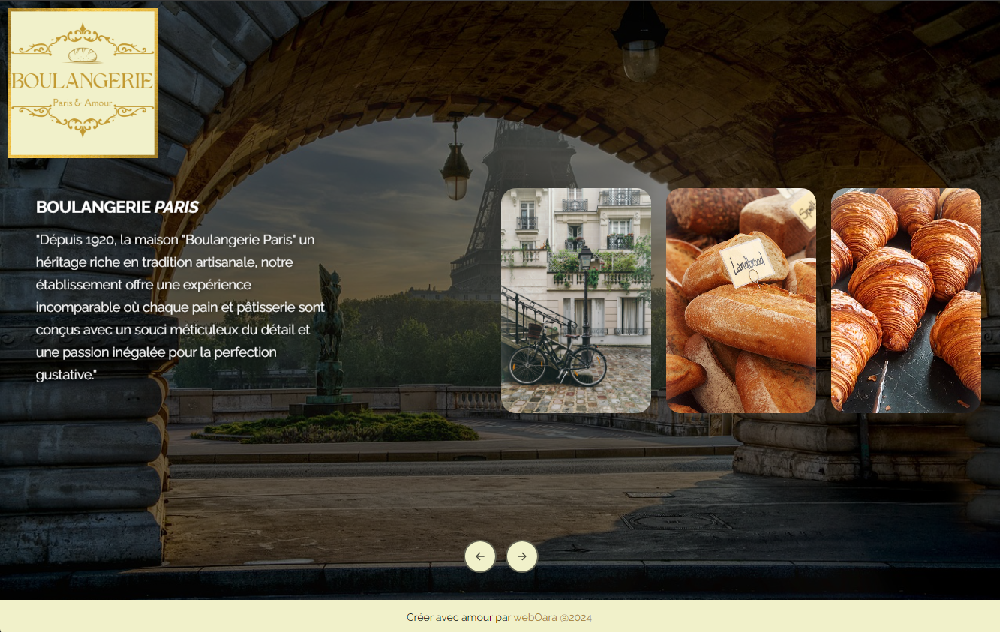

# Boulangerie Paris

## Description

Bienvenue dans mon projet ! Ce projet est conçu pour une expérience de fluidité sur les images mise en avant d'une boulangerie fictive , codée en HTML, CSS, et JavaScript. Le site s'adapte du plus petit au plus grand écran.

## Fonctionnalités

- **Effet de Parallaxe** : Les images de fond se déplacent à une vitesse différente par rapport au reste de la page, créant un effet de profondeur lorsque l'utilisateur interagit avec le site.
- **Design Responsive** : Le site est optimisé pour toutes les tailles d'écran, des petits smartphones comme l'iPhone SE aux écrans plus larges. Cela garantit une expérience utilisateur fluide et agréable, quel que soit l'appareil utilisé.

## Détails Techniques

### Effet de Parallaxe en JavaScript

L'effet de parallaxe est réalisé en JavaScript en déplaçant les éléments de la page à différentes vitesses lors de l'interaction de l'utilisateur. Le code JavaScript déplace les éléments en fonction des clics sur les boutons de navigation, en ajustant la position des éléments `.item` pour créer un effet de profondeur.

## Installation

Pour utiliser ce projet, suivez ces étapes :

1. git clone https://github.com/mimiecmoua/boulangerie

## Contribution

[CodePen](https://codepen.io/noirsociety/pen/ZEwLGXB)
